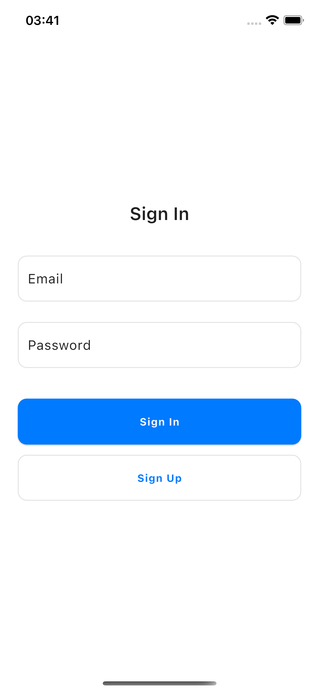
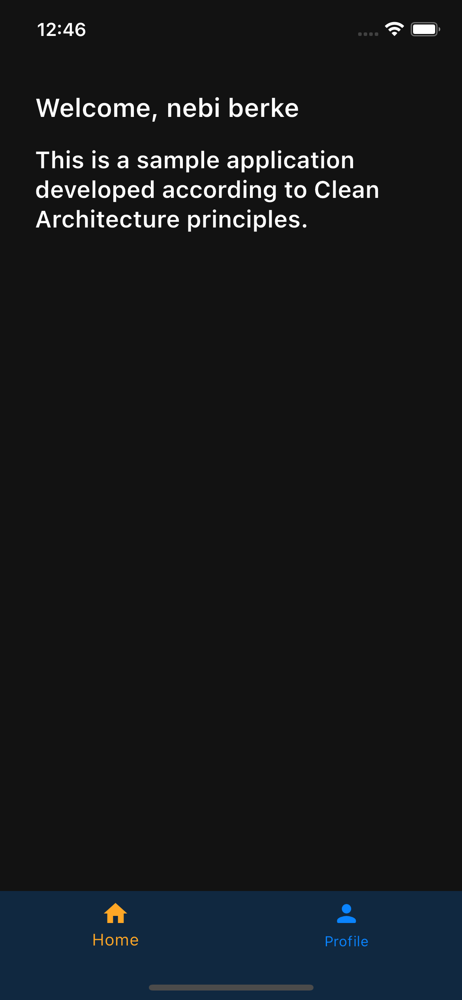
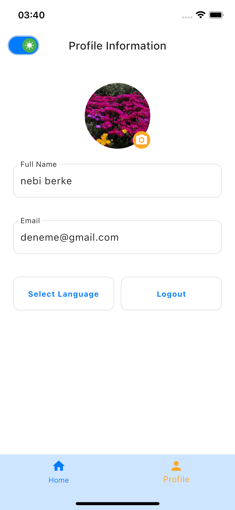
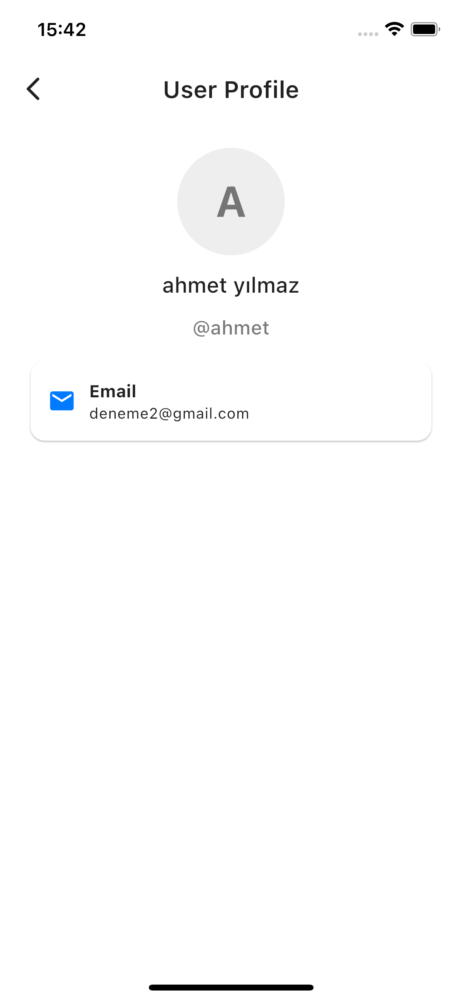

# Flutter Supabase Authentication Application

## Genel Bakış

Bu proje, **Flutter** ve **Supabase** kullanılarak geliştirilmiş bir kimlik doğrulama altyapısı (template) sağlamayı amaçlamaktadır. Modern yazılım geliştirme prensiplerine bağlı kalarak **Clean Architecture** ve **Domain-Driven Design (DDD)** ile yapılandırılmıştır. Profesyonel düzeyde bir kimlik doğrulama sisteminde bulunması gereken tüm temel bileşenleri içermektedir.

Bu proje, yalnızca kimlik doğrulama işlemlerini değil, aynı zamanda kullanıcı profillerinin güncellenmesi, hata yönetimi, bağımlılık yönetimi, state yönetimi ve çeşitli gelişmiş özellikleri de destekleyecek şekilde tasarlanmıştır. Öne çıkan özellikler şunlardır:

- **İnternet Bağlantısı Yönetimi**: İnternet kesintileri ve bağlantı sorunları yönetilerek kullanıcı deneyimi iyileştirilmiştir.
- **Tema ve Dil Desteği**: Açık ve koyu tema desteği ile birlikte çoklu dil desteği sunulmaktadır.
- **Profil Yönetimi**: Kullanıcıların profil bilgilerini düzenleyebileceği ve profil resmi yükleyebileceği bir yapı mevcuttur.
- **Cacheleme**: Kullanıcı verileri ve uygulama durumu **hydrated_bloc** ile saklanarak hızlı erişim sağlanmaktadır.
- **Gerçek Zamanlı Kullanıcı Verisi**: Kullanıcı bilgileri, **Supabase** ile gerçek zamanlı olarak veritabanından çekilmektedir.

Uygulama genişletilebilir ve modüler bir yapıya sahip olup, farklı projelere kolayca entegre edilebilir. **flutter_bloc** ile state yönetimi sağlanırken, **get_it** bağımlılık enjeksiyonu için kullanılmıştır. Ayrıca, **hydrated_bloc** ile durumların kalıcı hale getirilmesi sağlanmıştır. **go_router** ile dinamik yönlendirme yönetimi uygulanmıştır.

## Özellikler

- **Supabase Authentication**: E-posta ve parola tabanlı kullanıcı kaydı ve oturum yönetimi.
- **BLoC ile State Yönetimi**: Tüm uygulama akışı **flutter_bloc** kullanılarak düzenlenmiştir.
- **Profil Resmi Yükleme ve Güncelleme**: **image_picker** ve **cached_network_image** ile medya yönetimi yapılmaktadır.
- **Çoklu Dil Desteği**: **easy_localization** entegrasyonu ile uygulama birden fazla dilde kullanılabilir.
- **Tema Yönetimi**: Açık ve koyu tema desteği bulunmaktadır.
- **Bağımlılık Yönetimi**: **get_it** kullanılarak bağımlılıklar yönetilmiştir.
- **Cacheleme**: **hydrated_bloc** ile state verileri kalıcı olarak saklanmaktadır.
- **Yönlendirme Yönetimi**: **go_router** ile esnek ve yönetilebilir bir navigasyon sistemi oluşturulmuştur.
- **Test Kapsamı**: **mocktail** ile birim testleri yazılmıştır.

## 📱 Ekran Görüntüleri

<table>
  <tr>
    <td>Kimlik Doğrulama</td>
    <td>Anasayfa</td>
  </tr>
  <tr>
     <td></td>
     <td></td>
  </tr>
  <tr>
    <td>Profil</td>
    <td>Kullanıcı Profili</td>
  </tr>
  <tr>
     <td></td>
     <td></td>
  </tr>
</table>

## 🏗️ Mimari Yapı

Proje [Clean Architecture](https://github.com/ResoCoder/flutter-tdd-clean-architecture-course#readme) yaklaşımına göre yapılandırılmıştır:

```
lib/
│
├── app/
│   ├── constants/
│   ├── env/
│   ├── errors/
│   ├── initializer/
│   ├── l10n/
│   ├── router/
│   ├── theme/
│   ├── widgets/
│
├── core/
│   ├── enums/
│   ├── extensions/
│   ├── network/
│   ├── usecases/
│   ├── utils/
│
├── features/
│   ├── auth/
│   │   ├── data/
│   │   │   ├── datasources/remote/
│   │   │   ├── models/
│   │   │   ├── repositories/
│   │   ├── domain/
│   │   │   ├── entities/
│   │   │   ├── repositories/
│   │   │   ├── usecases/
│   │   ├── presentation/
│   │   │   ├── bloc/
│   │   │   ├── views/
│   │   │   ├── widgets/
│   ├── profile/
│
├── scripts/
└── test/
```

## 🔧 Kullanılan Paketler

### Ana Teknolojiler

- [Flutter](https://docs.flutter.dev) ^3.32.5
- [Dart](https://dart.dev) ^3.8.1

### State Management

- [flutter_bloc](https://pub.dev/packages/flutter_bloc)
- [hydrated_bloc](https://pub.dev/packages/hydrated_bloc)

### Routing

- [go_router](https://pub.dev/packages/go_router)

### Localization

- [easy_localization](https://pub.dev/packages/easy_localization)

### Dependency Injection

- [get_it](https://pub.dev/packages/get_it)

### Data Class Generation

- [freezed_annotation](https://pub.dev/packages/freezed_annotation)
- [json_annotation](https://pub.dev/packages/json_annotation)

### UI ve Utility

- [flutter_screenutil](https://pub.dev/packages/flutter_screenutil)
- [image_picker](https://pub.dev/packages/image_picker)
- [cached_network_image](https://pub.dev/packages/cached_network_image)
- [logger](https://pub.dev/packages/logger)

### Networking ve Veritabanı

- [supabase_flutter](https://pub.dev/packages/supabase_flutter)

### Fonksiyonel Programlama ve Cacheleme

- [dartz](https://pub.dev/packages/dartz)

### Kod Üretimi ve Test

- [freezed](https://pub.dev/packages/freezed)
- [json_serializable](https://pub.dev/packages/json_serializable)
- [mocktail](https://pub.dev/packages/mocktail)
- [very_good_analysis](https://pub.dev/packages/very_good_analysis)
- [envied](https://pub.dev/packages/envied)

## 🧪 Testler

- AuthRepository testleri
- ProfileRepository testleri
- UseCase testleri

```bash
flutter test
```

## 🛠️ Supabase Yapılandırması

### Database Tabloları

#### Profiles Tablosu

```sql
CREATE TABLE public.profiles (
    id UUID REFERENCES auth.users(id) ON DELETE CASCADE PRIMARY KEY,
    full_name TEXT,
    username TEXT UNIQUE,
    email TEXT,
    avatar_url TEXT,
    updated_at TIMESTAMP WITH TIME ZONE DEFAULT timezone('utc'::text, now()) NOT NULL
);
```

### Storage Yapılandırması

#### Avatars Bucket

```sql
INSERT INTO storage.buckets (id, name, public)
VALUES ('avatars', 'avatars', TRUE);
```

## 🚀 Kurulum Adımları

```bash
# 1. Depoyu klonlayın
git clone https://github.com/nebiberke/flutter_supabase_auth.git
cd flutter_supabase_auth

# 2. Paketleri yükleyin
flutter pub get

# 3. Ortam dosyasını oluşturun
mkdir env && touch env/.env

# 4. Supabase bilgilerinizi girin
SUPABASE_URL=your_supabase_url
SUPABASE_ANON_KEY=your_supabase_anon_key

# 5. Kod üretimini başlatın
dart run build_runner build

# 6. Uygulamayı başlatın
flutter run
```

## 👤 Geliştirici

- **GitHub**: [@nebiberke](https://github.com/nebiberke)
- **LinkedIn**: [Nebi Berke](https://linkedin.com/in/nebiberke)
