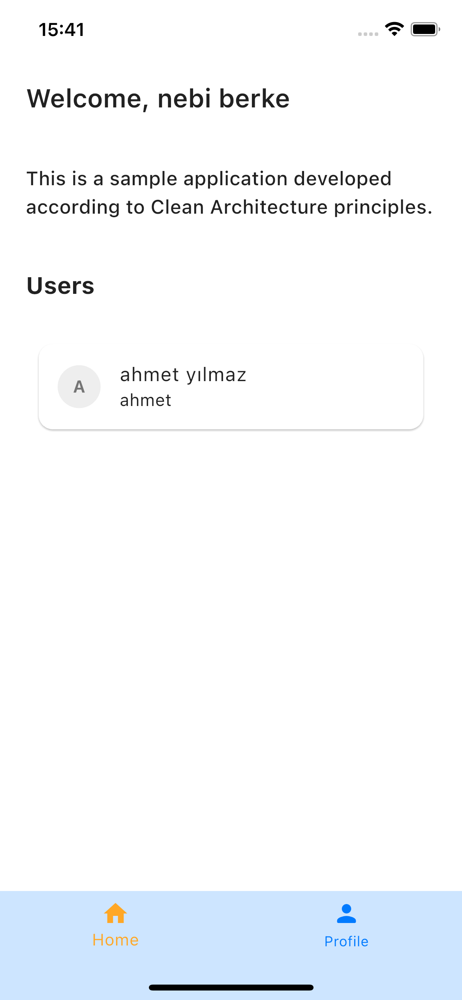

# Flutter Supabase Authentication Application

## Genel Bakış

Bu proje, **Flutter** ve **Supabase** kullanılarak geliştirilmiş bir kimlik doğrulama altyapısı (template) sağlamayı amaçlamaktadır. Modern yazılım geliştirme prensiplerine bağlı kalarak **Clean Architecture** ve **Domain-Driven Design (DDD)** ile yapılandırılmıştır. Profesyonel düzeyde bir kimlik doğrulama sisteminde bulunması gereken tüm temel bileşenleri içermektedir.

Bu proje, yalnızca kimlik doğrulama işlemlerini değil, aynı zamanda kullanıcı profillerinin güncellenmesi, hata yönetimi, bağımlılık yönetimi, state yönetimi ve çeşitli gelişmiş özellikleri de destekleyecek şekilde tasarlanmıştır. Öne çıkan özellikler şunlardır:

- **İnternet Bağlantısı Yönetimi**: İnternet kesintileri ve bağlantı sorunları yönetilerek kullanıcı deneyimi iyileştirilmiştir.
- **Tema ve Dil Desteği**: Açık ve koyu tema desteği ile birlikte çoklu dil desteği sunulmaktadır.
- **Profil Yönetimi**: Kullanıcıların profil bilgilerini düzenleyebileceği ve profil resmi yükleyebileceği bir yapı mevcuttur.
- **Cacheleme**: Kullanıcı verileri ve uygulama durumu **hydrated_bloc** ile saklanarak hızlı erişim sağlanmaktadır.
- **Gerçek Zamanlı Kullanıcı Verisi**: Kullanıcı bilgileri, **Supabase** ile gerçek zamanlı olarak veritabanından çekilmektedir.

Uygulama genişletilebilir ve modüler bir yapıya sahip olup, farklı projelere kolayca entegre edilebilir. **flutter_bloc** ile state yönetimi sağlanırken, **get_it** bağımlılık enjeksiyonu için kullanılmıştır. Ayrıca, **hydrated_bloc** ile durumların kalıcı hale getirilmesi sağlanmıştır. **go_router** ile dinamik yönlendirme yönetimi uygulanmıştır. 

## Özellikler

- **Supabase Authentication**: E-posta ve parola tabanlı kullanıcı kaydı ve oturum yönetimi.
- **BLoC ile State Yönetimi**: Tüm uygulama akışı **flutter_bloc** kullanılarak düzenlenmiştir.
- **Hata Yönetimi**: **dartz** ve **equatable** kullanılarak detaylı hata yönetimi sağlanmıştır.
- **Profil Resmi Yükleme ve Güncelleme**: **image_picker** ve **cached_network_image** ile medya yönetimi yapılmaktadır.
- **Çoklu Dil Desteği**: **easy_localization** entegrasyonu ile uygulama birden fazla dilde kullanılabilir.
- **Tema Yönetimi**: Açık ve koyu tema desteği bulunmaktadır.
- **Bağımlılık Yönetimi**: **get_it** kullanılarak bağımlılıklar yönetilmiştir.
- **Cacheleme**: **hydrated_bloc** ile state verileri kalıcı olarak saklanmaktadır.
- **Yönlendirme Yönetimi**: **go_router** ile esnek ve yönetilebilir bir navigasyon sistemi oluşturulmuştur.
- **Test Kapsamı**: **mocktail** ile birim testleri yazılmıştır.

## Önizleme

<table>
  <tr>
    <td>Login</td>
    <td>Register</td>
  </tr>
  <tr>
     <td></td>
     <td></td>
  </tr>
  <tr>
    <td>Home</td>
    <td>Profile</td>
  </tr>
  <tr>
     <td></td>
     <td></td>
  </tr>
</table>

## Mimari

Bu proje, [**Clean Architecture**](https://github.com/ResoCoder/flutter-tdd-clean-architecture-course#readme) prensiplerine göre yapılandırılmıştır. **Features**, **Core** ve **App** olmak üzere üç ana katmandan oluşmaktadır.

```
lib/
│
├── app/
│   ├── constants/
│   ├── env/
│   ├── errors/
│   ├── initializer/
│   ├── l10n/
│   ├── router/
│   ├── theme/
│   ├── widgets/
│
├── core/
│   ├── enums/
│   ├── extensions/
│   ├── network/
│   ├── usecases/
│   ├── utils/
│
├── features/
│   ├── auth/
│   │   ├── data/
│   │   │   ├── datasources/remote/
│   │   │   ├── models/
│   │   │   ├── repositories/
│   │   ├── domain/
│   │   │   ├── entities/
│   │   │   ├── repositories/
│   │   │   ├── usecases/
│   │   ├── presentation/
│   │   │   ├── bloc/
│   │   │   ├── views/
│   │   │   ├── widgets/
│   ├── profile/
│
├── scripts/
└── test/
```

## Kullanılan Paketler

### State Management
- [flutter_bloc](https://pub.dev/packages/flutter_bloc)
- [hydrated_bloc](https://pub.dev/packages/hydrated_bloc)

### Routing
- [go_router](https://pub.dev/packages/go_router)

### Localization
- [easy_localization](https://pub.dev/packages/easy_localization)

### Dependency Injection
- [get_it](https://pub.dev/packages/get_it)

### Data Class Generation
- [freezed_annotation](https://pub.dev/packages/freezed_annotation)
- [json_annotation](https://pub.dev/packages/json_annotation)

### UI ve Utility
- [cupertino_icons](https://pub.dev/packages/cupertino_icons)
- [flutter_screenutil](https://pub.dev/packages/flutter_screenutil)
- [logger](https://pub.dev/packages/logger)
- [path_provider](https://pub.dev/packages/path_provider)
- [image_picker](https://pub.dev/packages/image_picker)
- [flutter_native_splash](https://pub.dev/packages/flutter_native_splash)

### Networking ve Veritabanı
- [supabase_flutter](https://pub.dev/packages/supabase_flutter)
- [internet_connection_checker_plus](https://pub.dev/packages/internet_connection_checker_plus)

### Fonksiyonel Programlama ve Cacheleme
- [dartz](https://pub.dev/packages/dartz)
- [equatable](https://pub.dev/packages/equatable)

### Kod Üretimi ve Test
- [build_runner](https://pub.dev/packages/build_runner)
- [freezed](https://pub.dev/packages/freezed)
- [json_serializable](https://pub.dev/packages/json_serializable)
- [mocktail](https://pub.dev/packages/mocktail)
- [very_good_analysis](https://pub.dev/packages/very_good_analysis)

## Kurulum

### 1. Depoyu Klonlayın

Projeyi yerel ortamınıza almak için aşağıdaki komutu çalıştırın:

```sh
git clone https://github.com/nebiberke/flutter_supabase_auth
```

Ardından proje dizinine gidin:

```sh
cd project_directory
```

### 2. Bağımlılıkları Yükleyin

Flutter bağımlılıklarını yüklemek için aşağıdaki komutu çalıştırın:

```sh
flutter pub get
```

### 3. Supabase Yapılandırması

Uygulamanın çalışabilmesi için **Supabase** tarafında aşağıdaki ayarlamaları yapmanız gerekmektedir:

- **Kimlik Doğrulama Sağlayıcısı**: Supabase paneline giriş yapın ve **Authentication > Providers** sekmesinde **Email** sağlayıcısını etkinleştirin.
- **Depolama Bucket’ı**: **Storage** sekmesine giderek `profiles` isimli bir **bucket** oluşturun. Bu, kullanıcıların profil resimlerini saklamak için gereklidir.

### 4. Ortam Değişkenlerini Ayarlayın

Projeye özel Supabase bağlantı bilgilerini **env/.env** dosyanıza ekleyin:

```sh
SUPABASE_URL="YOUR_SUPABASE_URL"
SUPABASE_ANON_KEY="YOUR_SUPABASE_ANON_KEY"
```

### 5. Dil Dosyalarını ve Kod Üretimini Gerçekleştirin

Uygulamanın **çoklu dil desteği** için aşağıdaki komutu çalıştırarak dil dosyalarının oluşturulmasını sağlayın:

```sh
sh scripts/lang.sh
```

Kod üretme sürecini başlatmak için aşağıdaki komutu çalıştırın:

```sh
sh scripts/build_runner.sh
```

### 6. Uygulamayı Başlatın

Gerekli yapılandırmalar tamamlandıktan sonra aşağıdaki komut ile uygulamayı başlatabilirsiniz:

```sh
flutter run
```
